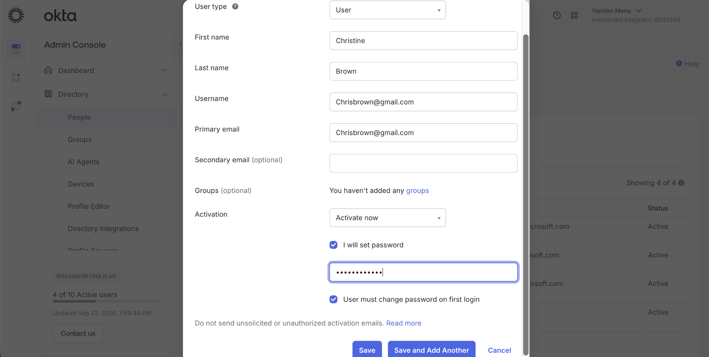
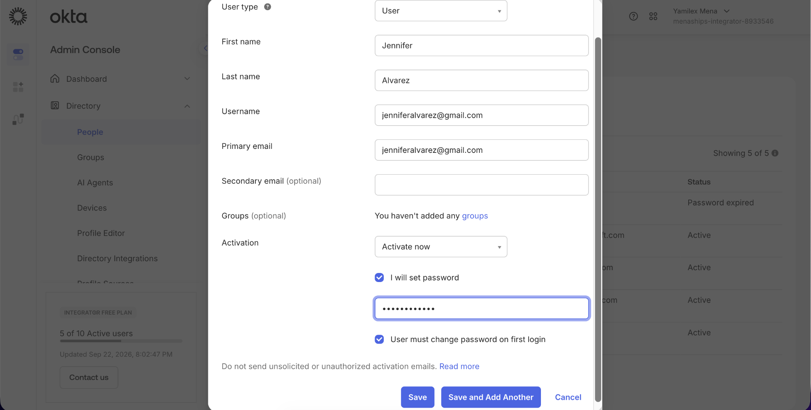
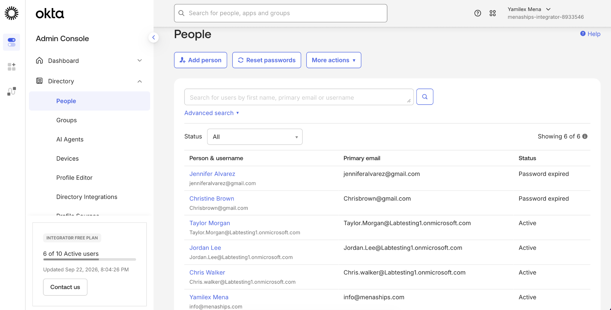
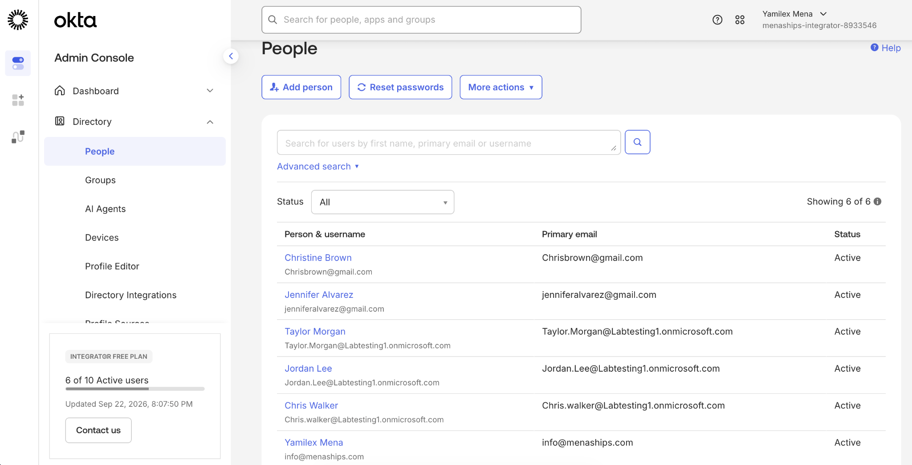

# Creating Users in Okta Manually

## Objective

Manually create new user accounts in Okta, configure their basic profile information and first-login password requirements, and verify that the accounts are successfully activated.

## Step 1: Create Christine Brown

Created a new Okta user profile for Christine Brown, configured the username and primary email, set an initial password, and required a password change on first login.

## Step 2: Create Jennifer Alvarez

Created a second Okta user profile for Jennifer Alvarez using the same onboarding process and first-login password requirement.

## Step 3: Verify First-Login Password Requirement

Reviewed the Okta People directory and confirmed that both new accounts were created with a **Password expired** status, requiring the users to change their initial passwords.

## Step 4: Verify Active Accounts

Confirmed that Christine Brown and Jennifer Alvarez completed the required password change and both accounts now show **Active** in the Okta directory.

## Skills Demonstrated

- Okta Administration
- Manual User Provisioning
- User Onboarding
- Identity and Access Management
- User Profile Configuration
- First-Login Password Controls
- Account Activation and Verification
